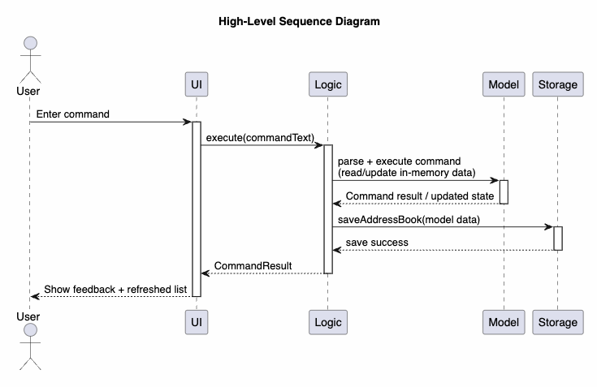

* Table of Contents
{:toc}

--------------------------------------------------------------------------------------------------------------------

## **Acknowledgements**

* This project is based on [AddressBook-Level3 (AB3)](https://github.com/se-edu/addressbook-level3) by the [SE-EDU initiative](https://se-education.org).
* The codebase and documentation structure were adapted from AB3 and extended for the CrimeWatch domain.

--------------------------------------------------------------------------------------------------------------------

## **Setting up, getting started**

Refer to [_Setting up and getting started_](SettingUp.md).

--------------------------------------------------------------------------------------------------------------------

## **Design**

:bulb: **Tip:** PlantUML source files are in `docs/diagrams`. This guide assumes rendered diagram images are also available under `docs/diagrams`.

### Architecture

> **UML Placeholder**: Replace `diagrams/ArchitectureDiagram.png` with the rendered output of `docs/diagrams/ArchitectureDiagram.puml`.

CrimeWatch follows a layered architecture with five main parts:
* `UI`: renders data and captures user input.
* `Logic`: parses and executes commands.
* `Model`: stores in-memory domain state.
* `Storage`: persists and loads data.
* `Commons`: shared helpers (`logs`, `config`, utility classes).

`MainApp` initializes `Storage`, `Model`, `Logic`, and `UI` in this order, and wires dependencies through interfaces.

At runtime, a typical command follows this high-level flow:
1. User enters a command in `UI`.
2. `Logic` parses the input into a concrete `Command`.
3. `Command` updates or queries `Model`.
4. `LogicManager` triggers persistence through `Storage`.
5. `UI` refreshes based on observable lists and command result feedback.

#### High-level runtime sequence

The diagram above summarizes the end-to-end interaction across `UI`, `Logic`, `Model`, and `Storage` for a typical command execution.

> **UML Placeholder**: Replace `diagrams/ArchitectureSequenceDiagram.png` with the rendered output of `docs/diagrams/ArchitectureSequenceDiagram.puml`.

> **UML Placeholder**: Replace `diagrams/ComponentManagers.png` with the rendered output of `docs/diagrams/ComponentManagers.puml`.

---

### UI component

#### API

[`Ui.java`](../src/main/java/seedu/address/ui/Ui.java)

> **UML Placeholder**: Replace `diagrams/UiClassDiagram.png` with the rendered output of `docs/diagrams/UiClassDiagram.puml`.

The UI is JavaFX-based and centered around `MainWindow`, which composes:
* `CommandBox` for command input.
* `ResultDisplay` for feedback messages.
* `PersonListPanel` for list rendering.
* `ViewPanel` for full contact profile details.
* `StatusBarFooter` for save path/status.
* `HelpWindow` for help content.

`UiManager` owns startup concerns (main stage setup, icon setup, fatal dialog handling), while `MainWindow` handles most user interaction wiring.

Design notes:
* `MainWindow` receives a `Logic` reference and executes commands through `logic.execute(...)`.
* `PersonListPanel` is bound to `logic.getFilteredPersonList()`.
* `CommandResult` flags (`showHelp`, `exit`, `personToView`) drive post-command UI behavior.

---

### Logic component

#### API

[`Logic.java`](../src/main/java/seedu/address/logic/Logic.java)

> **UML Placeholder**: Replace `diagrams/LogicClassDiagram.png` with the rendered output of `docs/diagrams/LogicClassDiagram.puml`.

The `Logic` component processes command text in this pipeline:
1. `LogicManager.execute(String)` receives raw input.
2. `AddressBookParser` determines command word and delegates to command-specific parser.
3. A concrete `Command` object is created and executed on `Model`.
4. `CommandResult` is returned to `UI`.
5. `LogicManager` persists state by calling `storage.saveAddressBook(...)`.

> **UML Placeholder**: Replace `diagrams/ParserClasses.png` with the rendered output of `docs/diagrams/ParserClasses.puml`.

Parser design:
* Command parsers implement the common `Parser<T>` interface.
* Prefix-based commands use `ArgumentTokenizer` and `ArgumentMultimap`.
* Validation and conversion are centralized in `ParserUtil`.
* Duplicate-prefix validation is handled by `verifyNoDuplicatePrefixesFor(...)`.

---

### Model component

#### API

[`Model.java`](../src/main/java/seedu/address/model/Model.java)

> **UML Placeholder**: Replace `diagrams/ModelClassDiagram.png` with the rendered output of `docs/diagrams/ModelClassDiagram.puml`.

`ModelManager` stores in-memory app state:
* `AddressBook` for canonical contact data.
* `UserPrefs` for application preferences.
* `FilteredList<Person>` + `SortedList<Person>` for UI-facing views.

Core domain type: `Person`, extended for CrimeWatch with:
* identity/contact fields (`Name`, `Phone`, `Email`, `Address`)
* investigation fields (`Stage`, `Risk`, `Alias`, `Notes`)
* collections (`Tag`, `Encounter`, `Reminder`)
* optional `Password` for feature-level access control

Design notes:
* identity uniqueness is enforced through `UniquePersonList` and `Person#isSamePerson`.
* sorting is view-level (via comparator on `SortedList`) and does not reorder persisted storage sequence.
* reminder entries are maintained in chronological order when added.

---

### Storage component

#### API

[`Storage.java`](../src/main/java/seedu/address/storage/Storage.java)

> **UML Placeholder**: Replace `diagrams/StorageClassDiagram.png` with the rendered output of `docs/diagrams/StorageClassDiagram.puml`.

Storage uses JSON persistence:
* `StorageManager` coordinates address book and preferences storage.
* `JsonAddressBookStorage` reads/writes contact data.
* `JsonUserPrefsStorage` reads/writes GUI/user preferences.
* `JsonSerializableAddressBook` + `JsonAdaptedPerson` bridge model objects and JSON schema.

Error behavior:
* Read/load errors surface to startup logic.
* Save errors during command execution are wrapped as user-visible `CommandException`s in `LogicManager`.

---

### Common classes

The `seedu.address.commons` package contains shared utilities:
* `LogsCenter` and logger setup.
* `GuiSettings` and config helpers.
* value/helper utilities (`StringUtil`, `ToStringBuilder`, etc.).

--------------------------------------------------------------------------------------------------------------------

## **Implementation**

This section documents key implementation decisions for major CrimeWatch features.

### Add command

#### Overview

`add` creates a new `Person` with required and optional fields:
* required: `n/`, `p/`, `e/`, `a/`, `s/`
* optional: `al/`, `note/`, `r/`, `pw/`, `t/`

#### Diagram placeholder

> **UML Placeholder**: Add a sequence diagram image at `diagrams/AddSequenceDiagram.png` (rendered from `docs/diagrams/AddSequenceDiagram.puml`).

#### Implementation

`AddCommandParser`:
* tokenizes input by supported prefixes.
* validates required prefixes and preamble constraints.
* rejects duplicate single-value prefixes.
* parses fields through `ParserUtil` and constructs `Person`.

`AddCommand#execute(Model)`:
* checks duplicate identity via `model.hasPerson(toAdd)`.
* inserts via `model.addPerson(toAdd)`.

#### Rationale and trade-off

* Prefix parsing keeps command input extensible and consistent with other commands.
* Strong upfront parser validation improves error specificity but increases parser complexity.

---

### Password-protected contact behavior

#### Overview

CrimeWatch supports optional contact-level passwords (`pw/`) for controlled access to sensitive operations.

Current behavior:
* `view`, `edit`, `log`, `remind` enforce password checks for protected contacts.
* For unprotected contacts, `log` and `remind` reject unexpected `pw/`.
* Passwords are stored as plain text in current implementation.

> **UML Placeholder**: Add image `diagrams/ViewPasswordSequenceDiagram.png` (rendered from `docs/diagrams/ViewPasswordSequenceDiagram.puml`).

#### Rationale and trade-off

* Contact-level protection provides lightweight operational gating without requiring a global login.
* Plain-text storage keeps implementation simple for educational scope, but is not suitable for production security requirements.

---

### Encounter logging and editing

#### Overview

Encounter workflow is split into:
* `log`: append a new encounter.
* `editencounter`: modify an existing encounter by person and encounter index.

`log` captures date, time, location, description, and optional outcome.

> **UML Placeholder**: Add image `diagrams/LogSequenceDiagram.png` (rendered from `docs/diagrams/LogSequenceDiagram.puml`).

#### Implementation notes

* `LogCommandParser` validates required prefixes and duplicate constraints.
* `LogCommand` performs optional password gating and reconstructs updated `Person` while preserving existing fields.
* `EditEncounterCommand` updates a specific encounter entry and validates both indices.

#### Rationale and trade-off

* Keeping encounters nested under `Person` simplifies retrieval and export by contact.
* Person reconstruction is explicit and safe, but increases the chance of accidental field omission when model schema changes.

---

### Reminder feature

#### Overview

`remind` appends reminder entries (`date`, `time`, `note`) to a contact.

> **UML Placeholder**: Add image `diagrams/RemindSequenceDiagram.png` (rendered from `docs/diagrams/RemindSequenceDiagram.puml`).

#### Implementation notes

* `RemindCommandParser` validates required prefixes and duplicate constraints.
* `RemindCommand` applies the same protection model as other sensitive commands.
* `ModelManager.addReminderToContact(...)` sorts reminders chronologically after insertion.

#### Rationale and trade-off

* Chronological sorting at insertion-time ensures consistent ordering across views.
* Sorting on each insertion is simple and adequate for target data sizes.

---

### Sort feature

#### Overview

`sort` applies a comparator over the displayed list using one criterion:
* `alphabetical`, `status`, `tag`, `location`, `recent`

This is a view-level sort; it does not mutate persisted data order.

> **UML Placeholder**: Add image `diagrams/SortActivityDiagram.png` (rendered from `docs/diagrams/SortActivityDiagram.puml`).

#### Implementation notes

* `SortCommandParser` enforces single-token criterion validation.
* `SortCommand` updates comparator via `model.setPersonSortComparator(...)`.
* `ModelManager` exposes `SortedList<Person>` to UI through `getFilteredPersonList()`.

#### Rationale and trade-off

* View-level sorting avoids destructive reordering and interacts cleanly with filtering.
* Comparator logic for derived fields (latest encounter location/time, smallest tag) is more complex but gives users practical sorting options.

---

### Export encounters to CSV

#### Overview

`export l/LOCATION` writes encounters at the specified location to:
`exports/CrimeWatch-export-<timestamp>.csv`.

> **UML Placeholder**: Add image `diagrams/ExportSequenceDiagram.png` (rendered from `docs/diagrams/ExportSequenceDiagram.puml`).

#### Implementation notes

* `ExportCommandParser` validates location input.
* `ExportCommand` scans contacts and encounters, filters by location, and writes rows to a CSV file.
* output directory is created if missing.

#### Rationale and trade-off

* CSV is easy to inspect and import into reporting tools.
* Exact location filtering keeps behavior predictable; partial/fuzzy matching is deferred for future enhancement.

--------------------------------------------------------------------------------------------------------------------

## **Documentation, logging, testing, configuration, dev-ops**

* [Documentation guide](Documentation.md)
* [Testing guide](Testing.md)
* [Logging guide](Logging.md)
* [Configuration guide](Configuration.md)
* [DevOps guide](DevOps.md)

--------------------------------------------------------------------------------------------------------------------

## **Appendix: Requirements**

### Product scope

**Target user profile**:
* undercover law enforcement officer managing persons of interest
* comfortable with keyboard-first workflows
* needs fast access to contact context under time pressure
* needs encounter tracking and follow-up reminders

**Value proposition**:
CrimeWatch helps officers manage and retrieve operational contact information quickly through a CLI-first workflow, while preserving encounter history and reminders.

### User stories

Priorities: High (must have) - `* * *`, Medium (nice to have) - `* *`, Low (unlikely to have) - `*`

| Priority | As a ... | I want to ... | So that I can ... |
| --- | --- | --- | --- |
| `* * *` | officer | add/edit/delete contacts | keep contact records current |
| `* * *` | officer | find contacts quickly | retrieve details under pressure |
| `* * *` | officer | log encounters | maintain a factual history |
| `* * *` | officer | view full profiles | see complete case context quickly |
| `* *` | officer | protect selected contacts with passwords | reduce casual unauthorized access |
| `* *` | officer | edit encounter entries | correct mistakes in logs |
| `* *` | officer | sort contact list by operational criteria | prioritize follow-ups efficiently |
| `* *` | officer | export encounters by location | prepare external reporting artifacts |
| `*` | officer | set reminders | avoid missing important follow-up actions |

### Use cases

(For all use cases below, the **System** is `CrimeWatch` and the **Actor** is the `officer`.)

**Use case: View a protected contact**

**MSS**
1. Officer requests to view a contact profile by index.
2. System detects contact is password-protected.
3. Officer supplies password.
4. System validates password and shows full profile.

Use case ends.

**Extensions**
* 1a. Index is invalid.  
  * 1a1. System shows an error message.  
  Use case ends.
* 3a. Password is missing or incorrect.  
  * 3a1. System shows an error message.  
  Use case ends.

**Use case: Log an encounter**

**MSS**
1. Officer enters `log` command with required encounter fields.
2. System validates input.
3. System appends encounter to target contact.
4. System confirms successful logging.

Use case ends.

**Extensions**
* 1a. Target index is invalid.  
  * 1a1. System shows an error message.
* 2a. Required fields are missing/invalid.  
  * 2a1. System shows an error message.
* 2b. Contact is protected and password is missing/incorrect.  
  * 2b1. System shows an error message.

### Non-Functional Requirements

1. Must run on mainstream OSes with Java `17` or higher.
2. Should support at least 1000 contacts with no noticeable lag for typical operations.
3. Common tasks should be faster via commands than equivalent mouse-heavy workflows.
4. Data file corruption and permission errors should fail gracefully with clear user feedback.
5. The design should remain maintainable under feature evolution (new command prefixes, additional `Person` fields).

### Glossary

* **Contact**: person of interest tracked in CrimeWatch.
* **Stage**: investigation lifecycle marker (`surveillance`, `approached`, `cooperating`, `arrested`, `closed`).
* **Encounter**: time-stamped interaction record linked to a contact.
* **Reminder**: scheduled note linked to a contact.
* **Protected contact**: contact with a configured `pw/` value.

--------------------------------------------------------------------------------------------------------------------

## **Appendix: Instructions for manual testing**

Given below are manual tests for major functional paths and edge cases.

:information_source: These are baseline checks. Testers are expected to perform additional exploratory testing.

### Launch and shutdown

1. Initial launch
   1. Download the jar file and place it in an empty folder.
   1. Run the jar file.  
      Expected: app window opens with sample contacts.

2. Window preference persistence
   1. Resize and reposition the app window, then close the app.
   1. Relaunch the app.  
      Expected: previous window size and location are restored.

### Add and edit contact

1. Add contact with required + optional fields
   1. Test case:  
      `add n/Mark Tan p/91234567 e/mark@example.com a/Blk 10 Clementi Ave 2 s/surveillance al/MT note/Seen near station r/high t/caseA`
   1. Expected: contact added with provided values.

2. Add contact with invalid stage
   1. Test case:  
      `add n/Mark Tan p/91234567 e/mark@example.com a/Blk 10 Clementi Ave 2 s/unknown`
   1. Expected: command rejected with stage validation message.

3. Edit protected contact without password
   1. Prerequisite: target contact has password.
   1. Test case: `edit 1 n/New Name`
   1. Expected: command rejected; password required message shown.

### View and password protection

1. View protected contact with correct password
   1. Prerequisite: contact at index 1 is protected with password `hunter2`.
   1. Test case: `view 1 pw/hunter2`
   1. Expected: full profile shown in view panel.

2. View protected contact with wrong password
   1. Test case: `view 1 pw/wrong`
   1. Expected: command rejected with incorrect password message.

### Log encounter and edit encounter

1. Log encounter successfully
   1. Test case:  
      `log 1 d/2026-04-09 t/18:30 l/Maxwell Road desc/Observed exchange out/No immediate action`
   1. Expected: encounter added and success message shown.

2. Edit encounter successfully
   1. Prerequisite: contact 1 has at least one encounter.
   1. Test case: `editencounter 1 1 out/Subject identified`
   1. Expected: first encounter for contact 1 updated.

### Reminder and sort

1. Add reminder
   1. Test case: `remind 1 d/2026-05-01 t/09:00 note/Follow up with source`
   1. Expected: reminder added and shown in sorted order in profile view.

2. Sort by recent
   1. Test case: `sort recent`
   1. Expected: list reordered by latest encounter timestamp, most recent first.

### Export and data persistence

1. Export by location
   1. Prerequisite: there are encounters at `Maxwell Road`.
   1. Test case: `export l/Maxwell Road`
   1. Expected: CSV generated under `exports/` with matching rows only.

2. Save/load smoke check
   1. Add or edit a contact.
   1. Exit and relaunch app.
   1. Expected: changes persist across restart.
