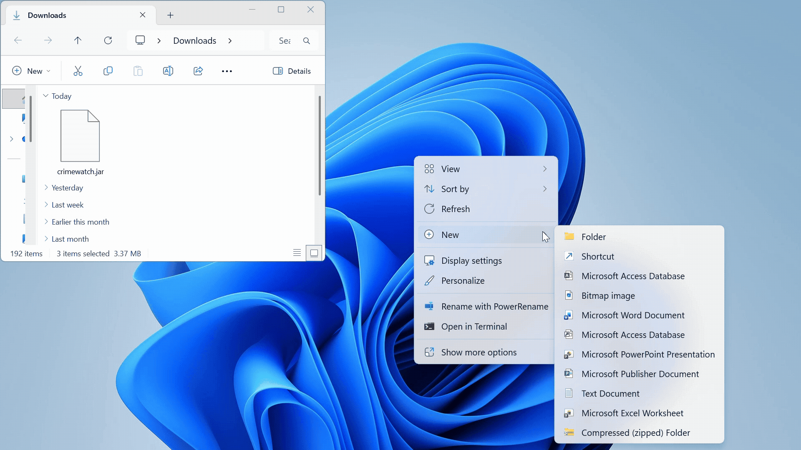
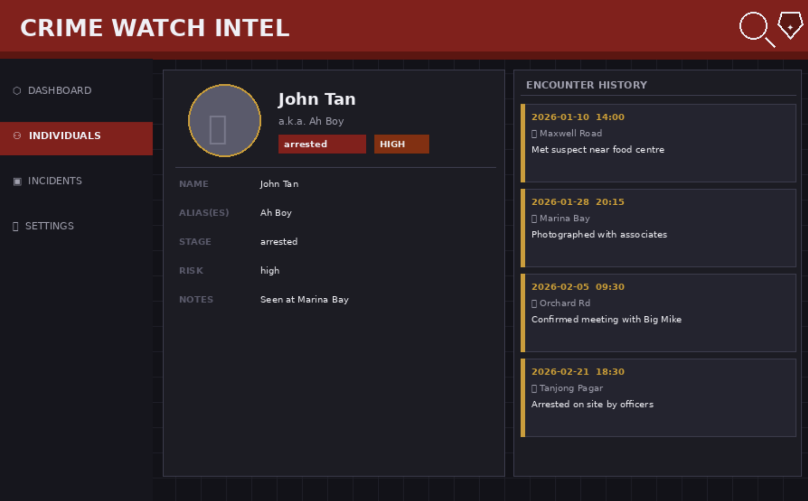

## Who is this guide for?
This guide is intended for users who prefer fast, keyboard-driven workflows. You should be comfortable with basic computer operations such as installing software and using a command terminal. No programming experience is required.

## What is CrimeWatch?
CrimeWatch is a CLI-based contact tracking tool for managing **person-of-interest profiles** and their **encounter logs**. The MVP supports exactly these five features:

1. Add Contact
2. Delete Contact
3. Log Encounter
4. View Contact
5. Search Contacts
   
* Table of Contents
{:toc}

--------------------------------------------------------------------------------------------------------------------

## Quick start

1. First, make sure you have Java `17` or above installed in your computer! 
   **Mac users:** Check that you have the exact JDK version [here](https://se-education.org/guides/tutorials/javaInstallationMac.html).

2. Next, download the latest `.jar` file from [here](https://github.com/se-edu/addressbook-level3/releases).

3. Then, move the 'crimewatch.jar' file to the folder you want to use as the _home folder_ for your AddressBook. (A new, empty folder is recommended)  

5. Now, open a command terminal from the folder you put the .jar file in. In the terminal, use the `java -jar addressbook.jar` command to run the application.  

6. The crimewatch app should appear! By default, the app has some sample data.  
   

7. Type the command in the command box and press Enter to execute it. e.g. typing **`help`** and pressing Enter will open the help window. 
   Some example commands you can try:

   * `list` : Lists all contacts.

   * `add n/John Doe p/98765432 e/johnd@example.com a/John street, block 123, #01-01` : Adds a contact named `John Doe` to the Address Book.

   * `delete 3` : Deletes the 3rd contact shown in the current list.

   * `clear` : Deletes all contacts.

   * `exit` : Exits the app.

8. Refer to the [Features](#features) below for details of each command.

--------------------------------------------------------------------------------------------------------------------

## Notes about the command format

- Words in `UPPER_CASE` are placeholders you replace with your own values.
- Prefixes use the format `prefix/value` (e.g. `n/John Tan`).
- Parameters can be in any order unless stated otherwise.
- Optional parameters are shown in square brackets `[LIKE_THIS]`.
- **Do not repeat prefixes** in the same command (e.g. `n/... n/...`) — this is treated as an error.
- Index-based commands (`view`, `log`, `delete`) use the **INDEX shown in the current contact list panel**.
  - INDEX must be a positive integer: `1, 2, 3, ...`
 
--------------------------------------------------------------------------------------------------------------------

## Features

**:information_source: Notes about the command format:** 

* Words in `UPPER_CASE` are the parameters to be supplied by the user. 
  e.g. in `add n/NAME`, `NAME` is a parameter which can be used as `add n/John Doe`.

* Items in square brackets are optional. 
  e.g `n/NAME [t/TAG]` can be used as `n/John Doe t/friend` or as `n/John Doe`.

* Items with `…`​ after them can be used multiple times including zero times. 
  e.g. `[t/TAG]…​` can be used as ` ` (i.e. 0 times), `t/friend`, `t/friend t/family` etc.

* Parameters can be in any order. 
  e.g. if the command specifies `n/NAME p/PHONE_NUMBER`, `p/PHONE_NUMBER n/NAME` is also acceptable.

* Extraneous parameters for commands that do not take in parameters (such as `help`, `list`, `exit` and `clear`) will be ignored. 
  e.g. if the command specifies `help 123`, it will be interpreted as `help`.

* If you are using a PDF version of this document, be careful when copying and pasting commands that span multiple lines as space characters surrounding line-breaks may be omitted when copied over to the application.

### Viewing help : `help`

Shows a message explaining how to access the help page.

Format: `help`

### 1) Add Contact: `add`

Creates a new contact profile (suspect / person of interest).

**Format**
`add n/NAME a/ALIAS s/STAGE [r/RISK] [note/NOTES]`

**Parameters**
- `n/NAME` (compulsory): full name
- `a/ALIAS` (compulsory): one or more aliases (**comma-separated**)
- `s/STAGE` (compulsory): investigation stage
- `r/RISK` (optional): risk level; default is `medium`
- `note/NOTES` (optional): initial notes (up to 500 characters)

**Examples**
- `add n/John Tan a/Ah Boy s/surveillance`
- `add n/Michael Lee a/Big Mike s/approached r/high note/Seen at Marina Bay`

#### Validation rules

**NAME**
- Length: 1–100 characters
- Allowed characters: letters, spaces, apostrophes, hyphens
- Leading/trailing spaces ignored; multiple internal spaces collapsed
- Error message (invalid):  
  `Invalid name. Name must contain only letters, spaces, apostrophes or hyphens, and cannot be empty.`

**ALIAS**
- 1–50 characters per alias
- Allowed characters: alphanumeric and spaces
- Multiple aliases separated by commas (e.g. `a/Ah Boy, Johnny T`)
- Error message (invalid):  
  `Invalid alias. Alias must be non-empty and alphanumeric.`

**STAGE** (case-insensitive)
Allowed values:
- `surveillance`
- `approached`
- `cooperating`
- `arrested`
- `closed`

Error message (invalid):  
`Invalid stage. Allowed values: surveillance, approached, cooperating, arrested, closed.`

**RISK** (optional)
Allowed values: `low`, `medium`, `high` (default: `medium`)

#### Duplicate handling
A new contact is considered a duplicate if:
- NAME is identical (case-insensitive, trimmed), **and**
- at least one alias overlaps.

Error message:
`Duplicate contact detected. A contact with similar name and alias already exists.`

**Success output**
`New contact added: [Name] (Stage: X, Risk: Y)`

--------------------------------------------------------------------------------------------------------------------

### 2) Delete Contact: `delete`

Removes a contact **and all associated encounters** permanently.

**Format**
`delete INDEX`

**Example**
`delete 3`

**Validation**
- INDEX must exist in the current list.
- Error: `Invalid index.`

**Success output**
`Deleted contact: [Name]. All associated encounters are removed.`

--------------------------------------------------------------------------------------------------------------------

### 3) Log Encounter: `log`

Records an interaction with a contact and appends it to the contact’s encounter history.

**Format**
`log INDEX d/DATE t/TIME l/LOCATION desc/DESCRIPTION [out/OUTCOME]`

**Parameters**
- `d/DATE` (compulsory): `YYYY-MM-DD`
- `t/TIME` (compulsory): `HH:mm` (24-hour)
- `l/LOCATION` (compulsory): location text
- `desc/DESCRIPTION` (compulsory): what happened (1–500 chars, not blank)
- `out/OUTCOME` (optional): result/follow-up (up to 300 chars)

**Example**
`log 1 d/2026-02-21 t/18:30 l/Maxwell Road desc/Met at coffee shop out/Agreed to cooperate`

#### Validation rules
- DATE must be a valid calendar date  
  Error: `Invalid date. Use format YYYY-MM-DD.`
- TIME must be valid 24-hour `HH:mm`  
  Error: `Invalid time. Use 24-hour format HH:mm.`
- DESCRIPTION cannot be blank; 1–500 characters

**Success output**
`Encounter logged for [Name] on 2026-02-21 18:30.`

--------------------------------------------------------------------------------------------------------------------

### 4) View Contact: `view`

Displays the full profile of a contact and their chronological encounter history.

**Format**
`view INDEX`

**Output (view panel)**
- Name
- Alias(es)
- Stage
- Risk
- Notes
- Encounter History (sorted by date-time ascending)

--------------------------------------------------------------------------------------------------------------------

### 5) Search Contacts: `find`

Retrieves contacts by keyword across multiple fields.

**Format**
`find KEYWORD [MORE_KEYWORDS]`

**Examples**
- `find john`
- `find mike marina`

**Behaviour**
- Case-insensitive
- Partial match allowed
- Matched fields: **Name**, **Alias**, **Notes**
- If no matches:  
  `No contacts found matching the given keywords.`

--------------------------------------------------------------------------------------------------------------------

### Clearing all entries : `clear`

Clears all entries from the address book.

Format: `clear`

### Exiting the program : `exit`

Exits the program.

Format: `exit`

### Saving the data

AddressBook data are saved in the hard disk automatically after any command that changes the data. There is no need to save manually.

### Editing the data file

AddressBook data are saved automatically as a JSON file `[JAR file location]/data/addressbook.json`. Advanced users are welcome to update data directly by editing that data file.

:exclamation: **Caution:**
If your changes to the data file makes its format invalid, AddressBook will discard all data and start with an empty data file at the next run. Hence, it is recommended to take a backup of the file before editing it. 
Furthermore, certain edits can cause the AddressBook to behave in unexpected ways (e.g., if a value entered is outside of the acceptable range). Therefore, edit the data file only if you are confident that you can update it correctly.

### Archiving data files `[coming in v2.0]`

_Details coming soon ..._

--------------------------------------------------------------------------------------------------------------------

## FAQ

**Q**: How do I transfer my data to another Computer? 
**A**: Install the app in the other computer and overwrite the empty data file it creates with the file that contains the data of your previous AddressBook home folder.

--------------------------------------------------------------------------------------------------------------------

## Known issues

1. **When using multiple screens**, if you move the application to a secondary screen, and later switch to using only the primary screen, the GUI will open off-screen. The remedy is to delete the `preferences.json` file created by the application before running the application again.
2. **If you minimize the Help Window** and then run the `help` command (or use the `Help` menu, or the keyboard shortcut `F1`) again, the original Help Window will remain minimized, and no new Help Window will appear. The remedy is to manually restore the minimized Help Window.

--------------------------------------------------------------------------------------------------------------------

## Command summary (MVP)

Action | Format | Example
---|---|---
Add Contact | `add n/NAME a/ALIAS s/STAGE [r/RISK] [note/NOTES]` | `add n/John Tan a/Ah Boy s/surveillance`
Delete Contact | `delete INDEX` | `delete 3`
Log Encounter | `log INDEX d/DATE t/TIME l/LOCATION desc/DESCRIPTION [out/OUTCOME]` | `log 1 d/2026-02-21 t/18:30 l/Maxwell Road desc/Met...`
View Contact | `view INDEX` | `view 1`
Search Contacts | `find KEYWORD [MORE_KEYWORDS]` | `find mike marina`
